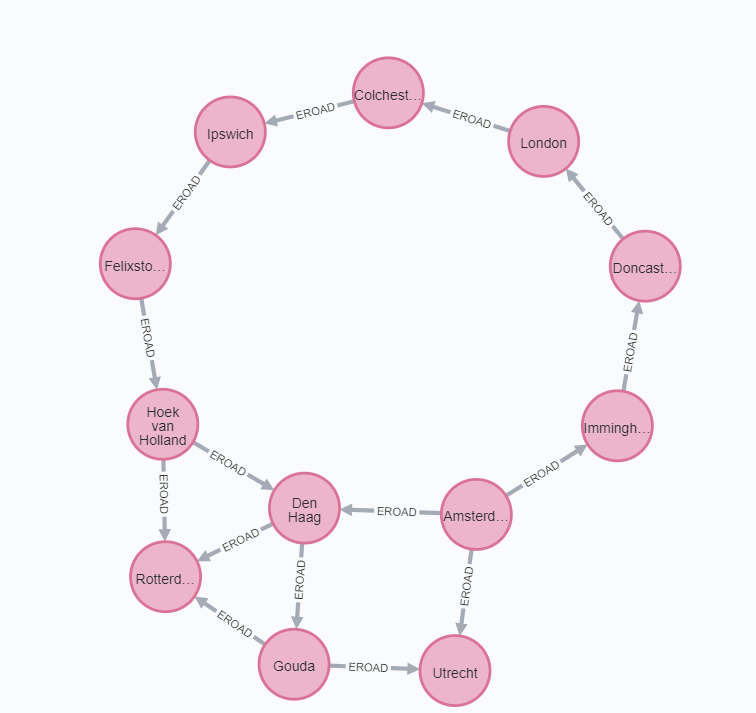
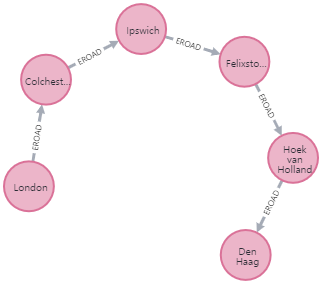

# Graph DB 배우기

## 교재

[**Graph Algorithms: Practical Examples in Apache Spark and Neo4j** / By Mark Needham & Amy E. Hodler Published by O'Reilly Media](https://neo4j.com/graph-algorithms-book/)

> 스파크 예제는 현재 하둡 문제로 실행 안됨


## 패스파인딩 + 그래프 알고리즘

> Breadth First Search and Depth First Search 할것이다. 왜냐면 펀더멘털이니까. 성능면에서 최적은 보장 못한다

사용 예

- 운송 루트 최적화
- 최저비용 전화 루트 또는 IP
- 게이밍 시뮬레이션(?)


특히 다음과 같은 것들을 다룬다

- Shortest path: 선택된 두개의 노드가 끝??
- Single Source Shortest Path: 루트 노드로 부터 다른 모든 노드까지 가장 짧은 경로 -> 선택된 노드로 부터 최종 Weight의 합이 가장 적은 경로
- All Paris Shortest Path and Single Source Shortest Path: 선택된 노드 대 모두 탐색 또는 모든 쌍중에 최소값
- Minimum Spanning Tree: 최소비용으로 노드 탐색 (한 노드로 부터 방문하지 않은 노드로 이동할떄 가장 적은 Weight를 선택해서 감)
- Random Walk: 프리프로세싱 / 셈플링할떄 좋음 


### Importing the Data into Neo4j


```cypher
WITH "https://github.com/neo4j-graph-analytics/book/raw/master/data/" AS base
WITH base + "transport-nodes.csv" AS uri
LOAD CSV WITH HEADERS FROM uri AS row
MERGE (place:Place {id:row.id})
SET place.latitude = toFloat(row.latitude),
 place.longitude = toFloat(row.longitude),
 place.population = toInteger(row.population);
```

```cypher
WITH "https://github.com/neo4j-graph-analytics/book/raw/master/data/" AS base
WITH base + "transport-relationships.csv" AS uri
LOAD CSV WITH HEADERS FROM uri AS row
MATCH (origin:Place {id: row.src})
MATCH (destination:Place {id: row.dst})
MERGE (origin)-[:EROAD {distance: toInteger(row.cost)}]->(destination);
```


### Breath First Search

> One of fundamental. Explore all the neighbor of first node and so on...


### Depth First Search

> DFS. 도달할 수 있는 최대한 까지 깊이 내력나다.

Charles Pierre Tremaux가 미로 문제를 풀기위해 만듬.


#### 특별한 두가지 경로 / 사이클

> *Eulerian path, Hamiltonian Path, Eulerian and Hamiltonian*


Eulerian Path

- 모든 관계를 한번씩 지나감.(노드 중복 가능)


Hamiltonian Path

- 모든 노드를 한번씩 지남(관계 중복 가능)
- *Traveling Salesman Problem*


Eulerian & Hamiltonian

- 모든 것을 한번씩 지남.


### Shortest Path

> Shortest(weighted) path


유명세 1950년

- 만약 가장 짧은 길이 막혔다면, 대안이 되는 가장 짧은 길(두번째로 짧은 길)을 찾는 법은?


1956 Edsgar Dijkstra

1. 시작 노드로 부터 가장 Weight가 낮은 관계 찾기
2. 찾은 후 가장 가까운 노드로 이동
3. 반복하지만 시작 노드로부터 "누계값"을 기준으로.
4. 목적 노드에 다다를떄 까지 반복


### 언제 Shortest Path를 사용하는가?

> Degree of separation, shortest distance between points, least expensive route


예시에 포함된 것

- 위치간 길안내 : 구글 맵
- 분할 정도 보여주기 : 링크드인 서로 아는 사이 등
- 어느 배우와 Kevin Bacon이 떨어진 정도


### Neo4j로 Shortest Path

> Weighted + Unweighted shortest path 가능.


다음과 같은 Key

- 시작 노드
- 끝 노드
- nodeProjection
  - in-memory graph?
- relationshipProjection
  - in-memory graph.
- relationshipWeightProperty
  - Number of kilometers between two locations.


#### Unweighted shortest path

```cypher
MATCH (source:Place {id: "Amsterdam"}),
 (destination:Place {id: "London"})
CALL gds.alpha.shortestPath.stream({
 startNode: source,
 endNode: destination,
 nodeProjection: "*",
 relationshipProjection: {
 all: {
 type: "*",
        orientation: "UNDIRECTED"
 }
 }
})
YIELD nodeId, cost
RETURN gds.util.asNode(nodeId).id AS place, cost;

```


|      | place       | cost |
| ---- | ----------- | ---- |
| 1    | "Amsterdam" | 0.0  |
| 2    | "Immingham" | 1.0  |
| 3    | "Doncaster" | 2.0  |
| 4    | "London"    | 3.0  |

결과는 다음과 같다. Hop의 숫자만 센 것




#### 실제 코스트 계산해보기

> Hop의 갯수가 그대로 일떄, 실제 Cost(거리)가 얼마일지 


```cypher
MATCH (source:Place {id: "Amsterdam"}),
 (destination:Place {id: "London"})
CALL gds.alpha.shortestPath.stream({
 startNode: source,
 endNode: destination,
 nodeProjection: "*",
           relationshipProjection: {
 all: {
 type: "*",
 orientation: "UNDIRECTED"
 }
 }
})
YIELD nodeId, cost
WITH collect(gds.util.asNode(nodeId)) AS path
UNWIND range(0, size(path)-1) AS index
WITH path[index] AS current, path[index+1] AS next
WITH current, next, [(current)-[r:EROAD]-(next) | r.distance][0] AS distance
WITH collect({current: current, next:next, distance: distance}) AS stops
UNWIND range(0, size(stops)-1) AS index
WITH stops[index] AS location, stops, index
RETURN location.current.id AS place,
 reduce(acc=0.0,
 distance in [stop in stops[0..index] | stop.distance] |
 acc + distance) AS cost;
```


결과값.

|      | place       | cost  |
| ---- | ----------- | ----- |
| 1    | "Amsterdam" | 0.0   |
| 2    | "Immingham" | 369.0 |
| 3    | "Doncaster" | 443.0 |
| 4    | "London"    | 720.0 |


#### Weighted Shortest Path


```cypher
MATCH (source:Place {id: "Amsterdam"}),
 (destination:Place {id: "London"})
CALL gds.alpha.shortestPath.stream({
 startNode: source,
 endNode: destination,
 nodeProjection: "*",
 relationshipProjection: {
 all: {
 type: "*",
 properties: "distance",
 orientation: "UNDIRECTED"
 }
 },
 relationshipWeightProperty: "distance"
})
YIELD nodeId, cost
RETURN gds.util.asNode(nodeId).id AS place, cost;
```


**relationshipWeightProperty: "distance"**가 들어갔다.

결과값

|      | place              | cost  |
| ---- | ------------------ | ----- |
| 1    | "Amsterdam"        | 0.0   |
| 2    | "Den Haag"         | 59.0  |
| 3    | "Hoek van Holland" | 86.0  |
| 4    | "Felixstowe"       | 293.0 |
| 5    | "Ipswich"          | 315.0 |
| 6    | "Colchester"       | 347.0 |
| 7    | "London"           | 453.0 |


### Shortest Path Variation: A*

> 좀더 빠르다. 경로를 선택할때 더 많은 정보를 허용한다.

Peter Hart, Nils Nilsson, and Bertrant Rapahel이 해먹었다.


메인 루프 매 시에 어느곳으로 가야할지 판단한다. 


$$
'F(n) = g(n) + h(n)'
$$
을 최소화 한다.


g(n) = 시작 노드부터 노드 n 까지 경로 비용

h(n) = 노드 n부터 목적지까지 추정 경로비용. 계층적으로 계산된다.


#### 용어

*startNode*

- 시작지점

*endNode*

- 끝나는 지점

*nodeProjection*

- 특정 노드만 포함시킬지 여부

*relationshipProjection*

- 특정 관계만 포함할지

*relationshipWeightProperty*

- 가중치, 거리, 킬로미터 등등 cost

*propertyKeyLat*

- 위도

*propertyKeyLon*

- 경도


#### 테이블 버전으로 실행

```cypher
MATCH (source:Place {id: "Den Haag"}),
 (destination:Place {id: "London"})
CALL gds.alpha.shortestPath.astar.stream({
	startNode: source,
	endNode: destination,
	nodeProjection: {
		Place:{
			properties: ['longitude', 'latitude']
 		}
 	},
 	relationshipProjection: {
 		all: {
			type: "*",
			properties: "distance",
			orientation: "UNDIRECTED"
 		}
 	},
    relationshipWeightProperty: "distance",
    propertyKeyLat: "latitude",
	propertyKeyLon: "longitude"
})
YIELD nodeId, cost
RETURN gds.util.asNode(nodeId).id AS place, cost;
```

|      | place              | cost  |
| ---- | ------------------ | ----- |
| 1    | "Den Haag"         | 0.0   |
| 2    | "Hoek van Holland" | 27.0  |
| 3    | "Felixstowe"       | 234.0 |
| 4    | "Ipswich"          | 256.0 |
| 5    | "Colchester"       | 288.0 |
| 6    | "London"           | 394.0 |


#### 그래프 버전으로 실행

```cypher
MATCH (source:Place {id: "Den Haag"}),
 (destination:Place {id: "London"})
CALL gds.alpha.shortestPath.astar.stream({
	startNode: source,
	endNode: destination,
	nodeProjection: {
		Place:{
			properties: ['longitude', 'latitude']
 		}
 	},
 	relationshipProjection: {
 		all: {
			type: "*",
			properties: "distance",
			orientation: "UNDIRECTED"
 		}
 	},
    relationshipWeightProperty: "distance",
    propertyKeyLat: "latitude",
	propertyKeyLon: "longitude"
})
YIELD nodeId, cost
RETURN gds.util.asNode(nodeId), cost;
```

